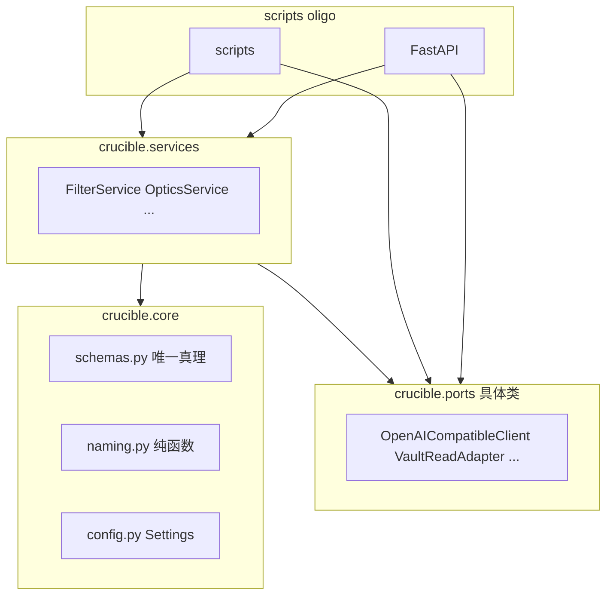

# REFACTOR_PLAN_V2 — 重构施工蓝图（去水化版）

**定位**：单兵极客外脑 —— 高可维护性，**拒绝**僵化抽象与样板协议层。  
**与草案差异**：已执行三项 **【去水化修正】** —— 无 Protocol/ABC、无 Shim 退路、**唯一** `schemas.py` 真理文件。  
路径以 `crucible_core/src/` 为默认根（文中写 `src/` 即此）。

---

## 依赖方向铁律（全 Phase 通用）



- **禁止**：`crucible.core` import `ports` / `services` / 旧包名。
- **禁止**：在 `core` 中定义 `Protocol` / `ABC` 作为「端口契约」—— **不设接口层**；Service **直接依赖具体 Adapter 类**（鸭子类型 + 构造注入即可）。
- **禁止**：`ports` 之间互相 import；共享无 IO 逻辑 → `core/naming.py` 或 `services` 内私有函数。
- **Composition root**：仅 `scripts/*.py` 与 FastAPI 装配处执行 `load_config()`、**具体** `OpenAICompatibleClient(...)`、`VaultReadAdapter(...)` 等构造；将实例 **注入** Service 的 `__init__`。Service **内部禁止** `load_config()` 与无参 `OpenAICompatibleClient()`。

---

# Phase 1: Physical Realm Realignment（物理目录与命名空间重组）

### 1.1 目标树（摘要）

| 新位置 | 职责 |
|--------|------|
| [`crucible/core/`](src/crucible/core/) | **`schemas.py`（全系统唯一 Pydantic 模型文件）**、`naming.py`（纯函数）、`config.py`（Settings） |
| [`crucible/ports/`](src/crucible/ports/) | **具体类**：LLM 客户端、Vault 读写、Paper 加载、MinerU、arXiv、Telegram、Jinja 渲染器 —— **无接口文件** |
| [`crucible/services/`](src/crucible/services/) | 业务：`FilterService`、`OpticsService`、`OligoAgentService`、批处理/日报编排 —— 构造函数接收 **具体** port 类实例 |
| [`oligo/`](src/oligo/)（可选保留） | 仅 HTTP：路由、装配具体依赖、调用 service |

**废弃策略**：`src/miners/`、`src/optics/` 在迁移完成后 **物理删除**。Import 通过 **全局搜索替换** 一次性改到新路径 —— **不设** re-export 垫片、**不设** legacy 别名模块。

### 1.2 旧文件 → 新文件映射表（原子级）

| 现行路径 | 新路径（建议） | 备注 |
|----------|----------------|------|
| `crucible/core/config.py` | 保留/精简 `core/config.py`；`load_config()` 可保留此文件或 `crucible/bootstrap.py` | 与 `config.yaml` 兼容优先 |
| `crucible/llm_gateway/client.py` | `ports/llm/openai_compatible_client.py`（类名可保留 `OpenAICompatibleClient`） | 具体类，无接口 |
| `crucible/llm_gateway/prompt_manager.py` | `ports/prompts/jinja_prompt_manager.py`（或同名 `PromptManager` 迁入） | 具体类 |
| `crucible/llm_gateway/janitor.py` | `ports/llm/json_janitor.py` 或 `core/naming.py` 旁纯函数 | 无 IO → 优先 `core` 或 `services` 工具 |
| `miners/paperminer/decision/filter_engine.py` | `services/filter_service.py` | `FilterService` |
| `optics/engine.py` | 并入 `services/optics_service.py` 或 `services/optics_irradiation.py` | 并发调度 |
| `optics/loader.py` | `services/optics_lens_registry.py` + 磁盘读写在 `ports/optics/` | 内嵌长字符串迁出到 `prompts/` |
| `optics/vault_indexer.py` | `ports/vault/vault_read_adapter.py` | 具体类 `VaultReadAdapter` |
| `miners/paperminer/io_adapter/file_router.py` | `ports/papers/paper_archive_adapter.py` | 具体类 `PaperArchiveAdapter` |
| `miners/paperminer/io_adapter/vault_writer.py` | `ports/vault/vault_note_writer.py` | 具体类；渲染调用由 service 协调 |
| `miners/paperminer/io_adapter/paper_loader.py` | `ports/papers/paper_loader.py` | 具体类 `PaperLoader`（可保留类名） |
| `miners/paperminer/workflows/ingest_pdfs.py` | `ports/ingest/mineru_pipeline.py` | MinerU 隔离 |
| `miners/paperminer/io_adapter/arxiv_fetcher.py` | `ports/arxiv/arxiv_fetch.py` | 具体类 |
| `oligo/tools/obsidian_search.py` | 合并进 `ports/vault/vault_read_adapter.py` | 避免双份 rglob |
| `oligo/core/agent.py` | `services/oligo_agent_service.py` | `OligoAgentService` |
| `oligo/api/server.py` | 削薄；统一 LLM 构造策略 | 见 Phase 2 |
| `crucible/io_adapter/telegram_notifier.py` | `ports/notify/telegram_notifier.py` | 具体类 |
| `crucible/utils/filename.py` | `core/naming.py` | 纯函数 |
| `miners/paperminer/core/paper.py` + `verdict.py` | **`core/schemas.py` 内段落/注释分区** | 见 Phase 2 |
| `optics/schema.py` | **`core/schemas.py`** | 禁止另文件 |
| `oligo/domain/schemas.py` | **`core/schemas.py`** | 禁止另文件 |
| `miners/paperminer/workflows/batch_filter.py` | `services/batch_filter_workflow.py` | |
| `miners/paperminer/workflows/chimera_daily.py` | `services/daily_chimera_service.py` | |
| `scripts/run_lens.py` 内联逻辑 | `OpticsService.run_lens_cli(...)` 或等价 | CLI 无 rglob |

### 1.3 冗余合并策略（file_router / vault_indexer / obsidian_search）

- **命名**：`core/naming.py` 统一 `fancy_basename`、`expected_stem`、从文件名解析 `short_moniker`（原 `_extract_short_moniker` 数学）。
- **读 Vault**：**一个**具体类 `VaultReadAdapter`（`ports/vault/`），方法含 `find_authenticated_paper`、`search_notes`（吞并 obsidian_search）。可多文件私有实现，**对外一个类**。
- **写/归档**：**独立** `PaperArchiveAdapter`，与 `VaultReadAdapter` **不**相互 import；仅各自接收 `Settings`。
- **filtered 全文定位**：从 CLI 迁入 `OpticsService`（或 service 内私有函数），CLI 只传参数。

---

# Phase 2: The Core & Config Sanctification（核心契约与配置净化）

### 2.1 宪法唯一化：`core/schemas.py`

**强制**：凡原 Paperminer、Oligo、Optics 及工作流统计用到的 **`BaseModel` / `Enum`**，**全部**迁入 **单一文件** [`src/crucible/core/schemas.py`](src/crucible/core/schemas.py)。

- 文件内可用 **注释分段**（如 `# --- Paper / Triage ---`、`# --- Optics ---`、`# --- Oligo ---`）组织可读性。
- **禁止**：`schemas_optics.py`、`schemas_api.py` 或任何「按域拆文件」的并列 schema 模块。
- **依赖**：仅 `pydantic`、`typing`、`enum`、`pathlib`；禁止 `openai`、`jinja2`、`requests`。

**迁入清单（与现代码对齐，非穷举）**：`PaperMetadata`, `Paper`, `VerdictDecision`, `PaperAnalysisResult`；`LensConfig`, `DeepReadAtlas` 及所有 `*Extraction` 模型；`ChatMessage`, `AgentInvokeRequest`；`BatchFilterStats` 及子项模型；等。

### 2.2 ~~`core/interfaces.py`~~ **已废除**

不设 Protocol/ABC 端口层。类型注解可直接写具体类，例如：

`def __init__(self, llm: OpenAICompatibleClient, prompts: PromptManager, ...):`

（若需减少循环 import，可用 **字符串注解** `from __future__ import annotations` + 延后 import，仍 **不** 引入接口文件。）

### 2.3 双重 Config 与 LLM 生命周期（具体类 + 注入）

| 问题 | 解法 |
|------|------|
| `OpenAICompatibleClient.__init__` 内 `load_config()` | **删除**；构造参数全部由 composition root 从单次 `settings = load_config()` 填入。 |
| Oligo lifespan 与 `agent_invoke` 各 new 一套 client | **统一**：例如 `app.state.default_llm` + 请求体覆盖时 `OpenAICompatibleClient(api_key=..., base_url=..., model=...)` **显式**构造；禁止无参默认构造依赖隐式配置（若保留无参，则必须与文档约定一致且单一路径）。 |
| `load_config()` 位置 | 全库 **单一** 入口函数；不重复实现。 |

**Dependencies**：先冻结 `Settings` 与 `config.yaml`；再改 `OpenAICompatibleClient` 与所有调用点；最后改 services。

---

# Phase 3: The Service Monolith Dismantling（业务服务剥离与注入）

### 3.1 `FilterService`（原 `PaperFilterEngine`）

| 改造点 | 说明 |
|--------|------|
| 构造 | `__init__(self, llm: OpenAICompatibleClient, prompts: PromptManager)`（**具体类**）；禁止内部 new client / new PromptManager。 |
| 边界校验 | `_validate_prompt_boundary`：删或改为测试/弱标记；**禁止**与 Jinja 同步维护英语魔法句。 |
| `evaluate_paper` | 业务与降级逻辑保留在 service。 |

### 3.2 `OpticsService`

| 改造点 | 说明 |
|--------|------|
| 透镜加载 | 磁盘 YAML + 资源文件；**禁止**在 `loader.py` 式模块内嵌巨型 JSON 军规字符串（迁到 `prompts/`）。 |
| `irradiate` | `OpenAICompatibleClient` 由 `__init__` 注入。 |
| 写出 | Service 组装视图数据 → `PromptManager.render` → `VaultNoteWriter`（具体类）写盘。 |

### 3.3 `OligoAgentService`（原 `ChimeraAgent`）

| 改造点 | 说明 |
|--------|------|
| LLM | 构造注入 `OpenAICompatibleClient`（或工厂，仍为具体类）。 |
| Vault 工具 | 构造注入 `VaultReadAdapter`，禁止直接 import 旧 `obsidian_search`。 |
| Router 文案 | 迁到 `prompts/oligo/...`，由 `PromptManager` 加载。 |

### 3.4 模板「擦屁股」：`deep_read_node.j2`

- Service 层生成 frontmatter（`yaml.safe_dump` 或整块字符串变量注入模板），**删除** Jinja 内对引号的 `replace` 链。
- 可选：`core/naming.py` 提供 `escape_yaml_scalar` 纯函数供端口注册 Jinja 过滤器（过滤器绑定纯函数，**不**为此新增接口文件）。

**Dependencies**：`schemas.py` 合并完成 + `PromptManager` 迁到 `ports` 后，再迁 service。

---

# Phase 4: CLI Decapitation（入口斩首）

纸片人：**仅** `argparse`、`load_config()`、构造 **具体** ports、构造 **具体** service、调用 `service.run_xxx()` / `asyncio.run(...)`。禁止 rglob、禁止业务分支堆在脚本（退出码映射可收进 `service` 返回值或极小 `main` 辅助函数）。

### `scripts/run_lens.py`（骨架）

```python
def main() -> int:
    args = parse_args()
    settings = load_config()
    settings.ensure_directories()
    llm = OpenAICompatibleClient(api_key=..., base_url=..., model=..., timeout_seconds=...)
    vault = VaultReadAdapter(settings)
    papers = PaperLoader()
    prompts = PromptManager()
    writer = VaultNoteWriter(settings, prompts)
    service = OpticsService(settings=settings, llm=llm, prompts=prompts, vault_writer=writer, ...)
    return asyncio.run(service.run_lens_cli(arxiv_id=args.id, survey=args.survey, vault=vault, papers=papers))
```

### `scripts/run_single.py`（骨架）

```python
def main() -> int:
    args = parse_args()
    settings = load_config()
    settings.ensure_directories()
    service = SinglePaperPipelineService(settings=settings, ...)  # 内聚 ingest/filter/vault/archive
    return service.run_single(pdf=args.pdf, md=args.md, force=args.force, ...)
```

### 其余 `run_batch_filter` / `run_daily` / `run_ingest` / `start_oligo`

同一模式：`parse` → `load_config` → 具体依赖 → 具体 workflow/service → 返回码。

**Dependencies**：对应 service 方法已实现后再替换脚本正文。

---

## 全 Phase 检查清单（含 Dependencies，已去接口/shim）

### Phase 1

- [ ] **P1.1** 建立 `crucible/ports/`、`crucible/services/` 与 `__init__.py`  
  - **Dependencies**：无。  
- [ ] **P1.2** `filename.py` → `core/naming.py`；全局替换 import  
  - **Dependencies**：P1.1。  
- [ ] **P1.3** 落地 `VaultReadAdapter`、`PaperArchiveAdapter`（具体类），行为对齐冒烟  
  - **Dependencies**：`Settings` 稳定；**无** `interfaces.py`。  
- [ ] **P1.4** 迁移完成后 **删除** `src/miners/`、`src/optics/` 目录；全库 **Search & Replace** 修正 import  
  - **Dependencies**：P1.2–P1.3 及依赖它们的代码已迁完；**无 shim**。  

### Phase 2

- [ ] **P2.1** 合并 **全部** 模型至 **唯一** `core/schemas.py`  
  - **Dependencies**：仅 pydantic；最先于 services 大改前完成。  
- [ ] **P2.2** `OpenAICompatibleClient` 去掉内部 `load_config`；调用点显式传参  
  - **Dependencies**：P2.1 若涉及 client 引用的模型类型，则先 P2.1。  

### Phase 3

- [ ] **P3.1** `FilterService` 替换 `PaperFilterEngine`（构造注入具体类）  
  - **Dependencies**：P2.2 + ports 就位。  
- [ ] **P3.2** `OpticsService` + frontmatter 净化  
  - **Dependencies**：`DeepReadAtlas` 已在 `schemas.py`。  
- [ ] **P3.3** `OligoAgentService` + 注入 `VaultReadAdapter`  
  - **Dependencies**：P1.3。  

### Phase 4

- [ ] **P4.1** 削薄 `run_lens.py`、`run_single.py`  
  - **Dependencies**：P3.1–P3.2。  
- [ ] **P4.2**（可选）可编辑安装 / `python -m` 减少 `sys.path` hack  
  - **Dependencies**：目录稳定后。  

---

## 破坏性重构与风险控制（无 Shim）

- **策略**：在独立 Git 分支上完成移动；每批改动后 **`python -m compileall`** 与最小手工冒烟。  
- **Import 修复**：依赖 IDE / `rg` **全局替换** 旧路径 → 新路径；**不**保留 `legacy` / `compat` 重导出模块。  
- **回滚**：仅 **Git revert / 分支丢弃**；不在代码库内维护「过渡期双轨」。  

---

*本蓝图取代草案中与 `interfaces.py`、多文件 schema、shim 相关的所有叙述。*
